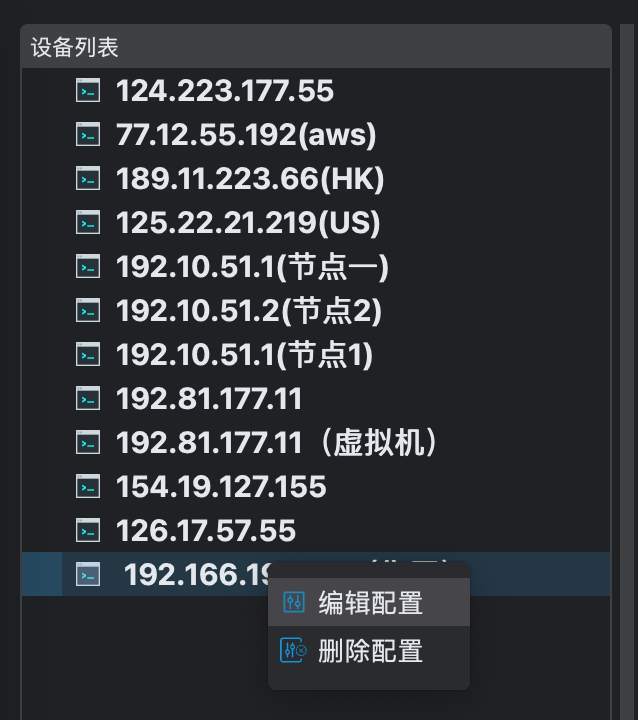
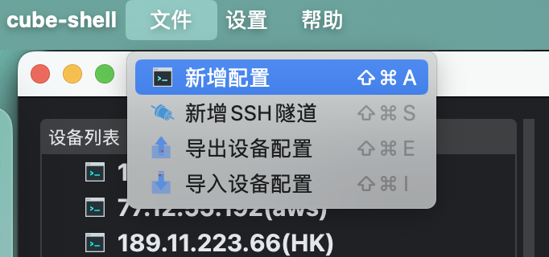
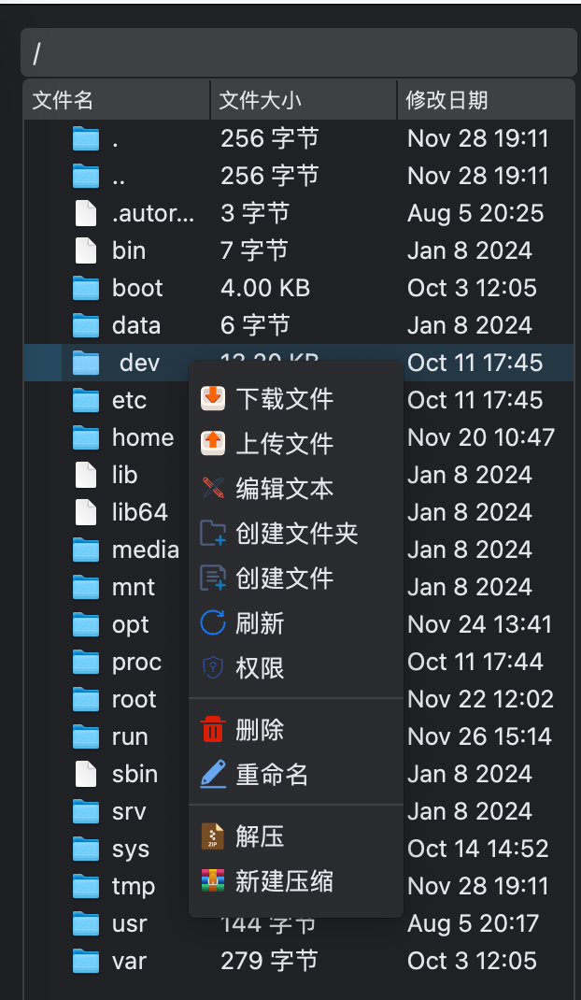
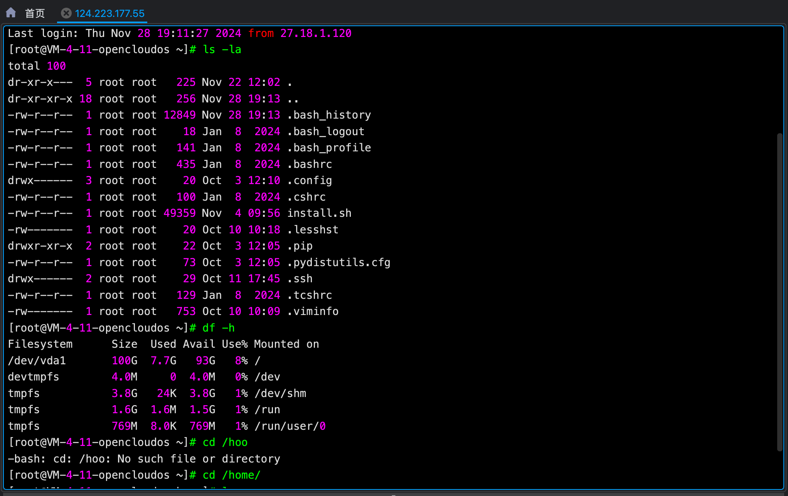
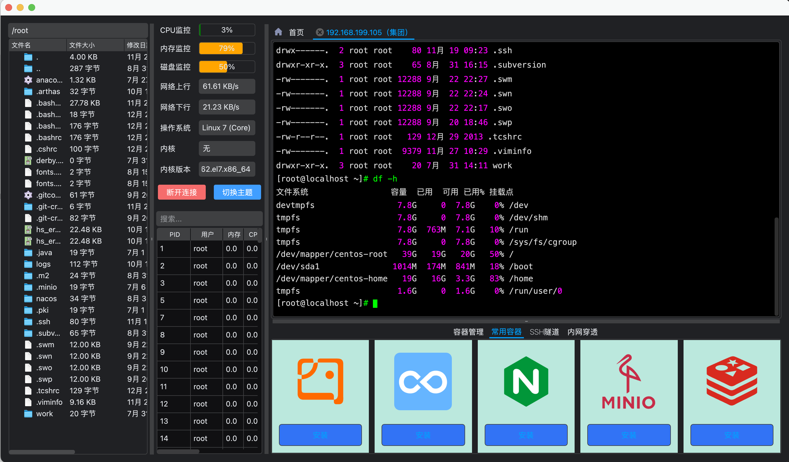
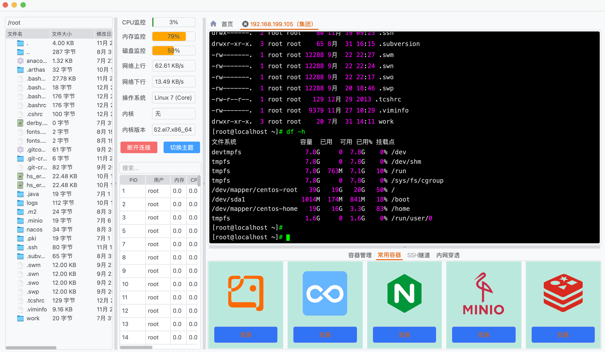
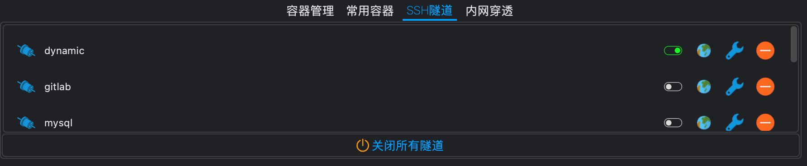
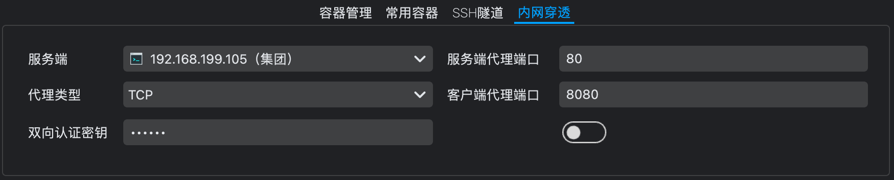
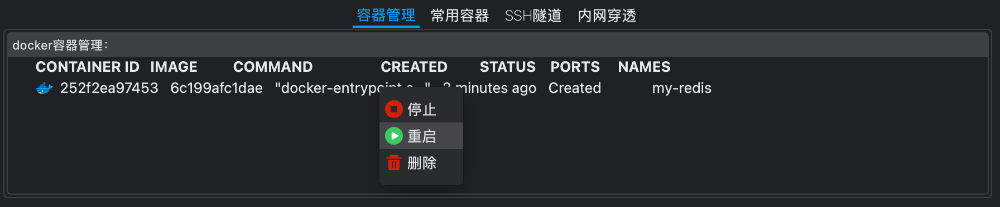
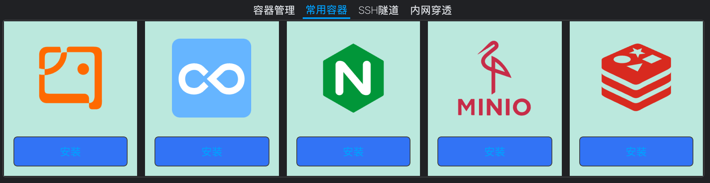

<div align="center">
<a href="https://github.com/Cubeiic-HanXuan/cube-shell-cpp/">

</a>
</div>

<p align="center">
  <a href="./README.md">简体中文</a> |
  <a href="./README.en.md">English</a>
</p>

![platform-badge] ![Cpp-badge] ![License-badge] ![release-badge] ![download-badge] ![download-latest]

## cube-shell

#### 介绍

`cube-shell`是`linux` 服务器远程运维管理工具，可以代替Xshell、XSftp、MobaXterm 等工具对服务器进行管理，`cube-shell` 简洁且强大。市面上大多数ssh客户端工具都是集成了很多没有用的菜单，而且ui设计十分复杂，对于初用者不太友好。

`cube-shell`的设计初衷就是简洁且实用，没有任何多余的菜单干扰我们使用它。安装也很简单，解压不需要安装，就可以直接使用。

> 本仓库为 `cube-shell` 的 C++ 重写版本，基于 Qt6 和 libssh2 开发，提供更优异的性能和原生体验。

### cube-shell有哪些功能？
**1.设备列表**



- 新增配置
- 编辑配置
- 删除配置

**2.快捷菜单栏**

每个菜单栏都支持快捷键

- 新增配置
- 新增SSH隧道
- 导出设备配置
- 导入设备配置


**3.支持sftp协议对文件的操作**


下载文件（支持批量下载）
- 上传文件（支持批量上传）
- 编辑文件
- 创建文件夹
- 创建文件
- 刷新（新增功能）
- 删除文件和文件夹（支持批量删除）

**4.支持ssh协议远程操作linux系统**



- 可以进行终端操作
- 支持多标签（支持相同服务器）
- 支持标签拖动顺序
- 支持复制、粘贴、清屏
- 代码高亮显示
- 支持切换终端主题
- 支持命令行补全功能
- 支持多标签之间终端和`sftp`文件区域联动


**5.主题切换**

`cube-shell 1.5.x`版本优化了具有现代化IDE风格的整体主题背景切换，依然支持两种主题切换，暗主题和亮主题两种



**6.状态栏**


- CPU 监控
- 内存监控
- 磁盘监控
- 网络上行
- 网络下行
- 操作系统
- 内核
- 内核版本
- 进程管理（支持快速kill进程，支持进程搜索）

**7.扩展功能区**
- SSH隧道功能
  
- 内网穿透功能
  
- 容器管理功能
  
- 常用容器功能
  


### 软件架构
`cube-shell`主要使用`C++`语言开发，构建系统为 CMake，第三方依赖由 vcpkg 管理。

主要使用技术：
|   名字  |  版本   |  描述   |
| --- | --- | --- |
|  C++   |  17   |  编译标准   |
|  Qt   |  6.x   |  跨平台GUI框架   |
|  libssh2   |  1.11+   |  SSH协议库   |
|  OpenSSL   |  3.x   |  TLS/加密库   |
|  yaml-cpp   |  0.8+   |  YAML解析库   |
|  FreeRDP   |  3.x   |  RDP远程桌面协议库（可选，默认关闭）   |
|  cJSON   |  1.7+   |  JSON解析库   |
|  vcpkg   |  latest   |  C++包管理器   |
|  frp   |   0.61.0  |  内网穿透套件   |

**图标主要来源以下两个图标库：**

`https://icons8.com/icons/color`

`https://www.iconfont.cn/`

#### 安装教程

可以直接下载 [Releases](https://github.com/Cubeiic-HanXuan/cube-shell-cpp/releases) 中最新发行版应用程序，也可以克隆源代码自行编译。

`cube-shell` 使用 [CMake](https://cmake.org/) 构建，第三方依赖通过 [vcpkg](https://vcpkg.io/) 以清单模式（`vcpkg.json`）自动获取并编译。

##### 前置条件

| 条件 | 说明                                                        |
| --- |-----------------------------------------------------------|
| CMake | **3.24** 或更高版本                                            |
| C++ 编译器 | 支持 C++17（GCC 9+、Clang 10+、MSVC 2019+）                     |
| Qt | **6.5** 或更高版本                                             |
| vcpkg | 用于管理第三方依赖                                                 |
| Git | 用于克隆仓库                                                    |
| 磁盘空间 | 建议至少预留 **3 GB**（vcpkg 编译依赖 + 构建文件）                        |

##### 通用步骤（所有平台）

克隆仓库：

```bash
git clone https://github.com/Cubeiic-HanXuan/cube-shell-cpp.git
cd cube-shell-cpp
```

##### 编译 macOS 程序

```bash
# 安装 vcpkg（如未安装）
git clone https://github.com/microsoft/vcpkg.git
./vcpkg/bootstrap-vcpkg.sh

# 配置并构建
cmake -B build -DCMAKE_TOOLCHAIN_FILE=./vcpkg/scripts/buildsystems/vcpkg.cmake
cmake --build build --config Release -j$(sysctl -n hw.ncpu)
```

##### 编译 Linux (Ubuntu/Debian) 程序

```bash
# 安装系统依赖
sudo apt-get install -y build-essential cmake pkg-config \
    qt6-base-dev qt6-tools-dev libgl1-mesa-dev

# 安装 vcpkg（如未安装）
git clone https://github.com/microsoft/vcpkg.git
./vcpkg/bootstrap-vcpkg.sh

# 配置并构建
cmake -B build -DCMAKE_TOOLCHAIN_FILE=./vcpkg/scripts/buildsystems/vcpkg.cmake
cmake --build build --config Release -j$(nproc)
```

##### 编译 Windows 程序

```powershell
# 安装 vcpkg（如未安装）
git clone https://github.com/microsoft/vcpkg.git
.\vcpkg\bootstrap-vcpkg.bat

# 配置并构建（使用 MSVC）
cmake -B build -DCMAKE_TOOLCHAIN_FILE=.\vcpkg\scripts\buildsystems\vcpkg.cmake
cmake --build build --config Release
```

##### 产物说明

产物位于 `build/bin/` 目录。

> RDP 远程桌面支持默认关闭，如需启用请在配置阶段追加 `-DCUBESHELL_WITH_RDP=ON`。

#### 参与贡献
欢迎各位朋友积极参与代码贡献。

1.  Fork 本仓库
2.  新建 Feat_xxx 分支
3.  提交代码
4.  新建 Pull Request

#### 视频教程地址
[cube-shell-video](https://mp.weixin.qq.com/s/ntDuDipnCqN4v2Y4Urzo6w)

#### 有任何不懂的可以加交流群
<div>


</div>

[platform-link]: https://github.com/Cubeiic-HanXuan/cube-shell-cpp/releases "Platform"
[platform-badge]: https://img.shields.io/badge/platform-Windows%20%7C%20macOS%20%7C%20Linux-lightgrey.svg "Platform"
[License-link]: https://github.com/Cubeiic-HanXuan/cube-shell-cpp/blob/master/LICENSE "License"
[License-badge]: https://img.shields.io/badge/License-LGPL%20v3-blue.svg "License"
[Cpp-link]: https://isocpp.org/ "C++"
[Cpp-badge]: https://img.shields.io/badge/C%2B%2B-17-blue.svg "C++"
[release-link]: https://github.com/Cubeiic-HanXuan/cube-shell-cpp/releases "Release status"
[release-badge]: https://img.shields.io/github/release/Cubeiic-HanXuan/cube-shell-cpp.svg?style=flat-square "Release status"
[download-link]: https://github.com/Cubeiic-HanXuan/cube-shell-cpp/releases/latest "Download status"
[download-badge]: https://img.shields.io/github/downloads/Cubeiic-HanXuan/cube-shell-cpp/total.svg "Download status"
[download-latest]: https://img.shields.io/github/downloads/Cubeiic-HanXuan/cube-shell-cpp/latest/total.svg "latest status"